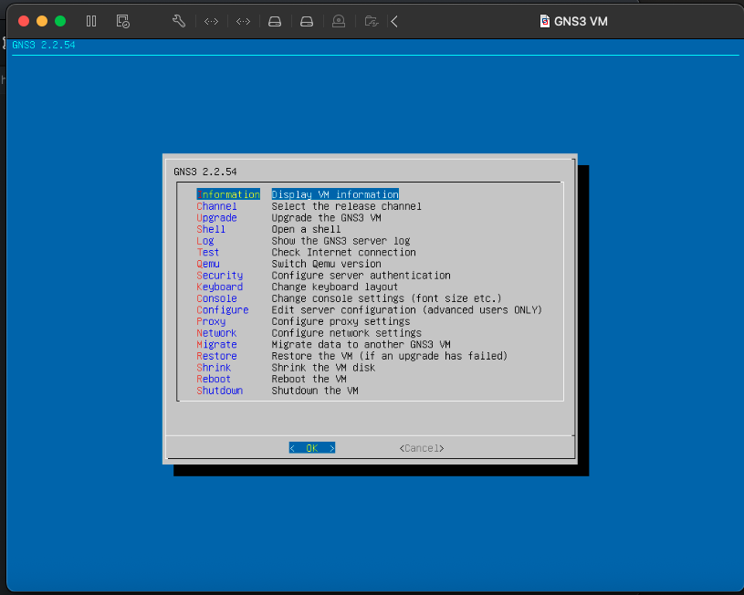

# Setup

## Common Commands

# VLAN
The image below shows a basic vlan setup in GNS3 on my host os. Since the physical switch and router connect directly to the Windows VM, GNS3 had to be installed and configured there, so the images will be shown later on this Windows setup, configuration, test and integration.

Simple vlan

## Common VPC Commands

## Ping test between VPCs on a LAN
Configured an ip address and default gateway for both PCs and then tested communication between them both.
