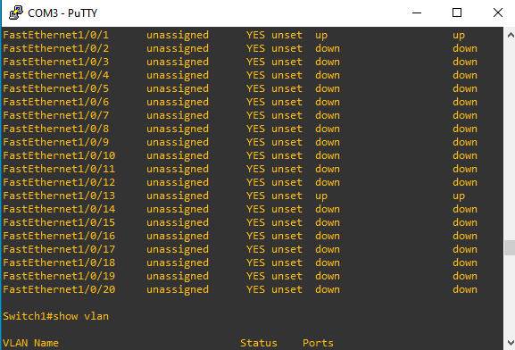

## Setting up the LAN in GNS3
The first step was setting up the basic lan in GNS3, as seen in the screenshots within this folder

## Configuring a Port on The Switch to connect to GNS3
The commands below were entered into the switch to configure a new port for connecting GNS3 virtually to the physical device.

```
enable
configure terminal

interface FastEthernet1/0/11
    description GNS_Lab_Port
    switchport mode acccess
    switchport access vlan 10
    spanning-tree portfast
    no shutdown
exit
```
After entering the ```show vlan``` command for the switch, the output shows that FastEthernet1/0/11 has been added to vlan 10.


## Cable Connection
After Plugging in the Ethernet cable from switchport11 to the host device the port is now labeled as up.
<!-- -->


The image below shows the Ethernet connection to FastEthernet1/0/11 on the switch. The other end of this cable is connected to the Ethernet port of the host device.

## Troubleshooting
After configuring the router and switch an attempt was made to ping the VPCs (assuming trunking was successfully setup). Pinging gave errors, and this is the troubleshooting process that followed.


My goal is to connect my virtual devices to my physical devices and make a hybrid homelab that can be more scalable than the current limitations of my client devices (I don't have many devices to connect to my switch, and I am limited by the number of ethernet ports on my host os without the use of a hub). This required setting up VPCs on GNS3 and configuring the router and switch for the right vlans, for trunking and for the correct default gateway; also for the correct port connection.

So far, since my host OS has only 1 Ethernet connection I've been able to successfully ping from 1 device at a time by rotating the switch between ports. If I wanted to connect 2 devices, I would require 2 Ethernet port connections. This is not scalable so I am trying to successfully enable trunking so that I can connect x amount of vlans (or devices, VPCs) from GNS3 to my switch using only one trunked port connection. I am now able to communicate between devices in a vlan (turns out it was a subnetting issue that caused the devices to stop communicating with each other), but now I can no longer connect to the default gateway :(

    I'll get to the bottom of this

    So the next step was to add a router to GNS3 and then connect that router to my phyisical router. The router images are not installed by default and the only available software is through Cisco's website via purchasing of the router iso image. The images are a bit pricey, so an alternative I came across was to use VyOS. Dear technical diary, I didn't think I would be the type of person to run a virtual machine - inside another virtual machine... but here I am.