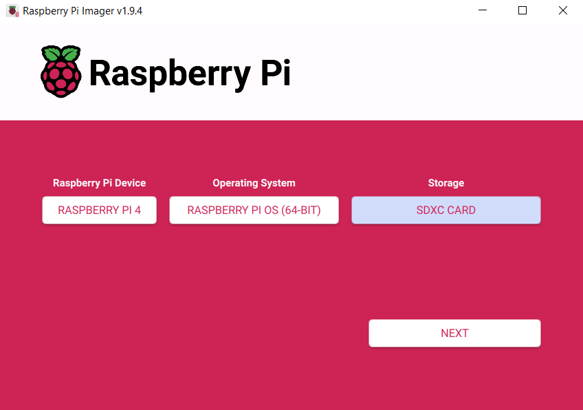

# Setup

- Installed the Raspberry Pi Installer applicaiton in order to flash the Raspbian OS onto a removable SD card that will be ran inserted into and ran on the raspberry pi.

Formatting the SD Card with Raspberry Pi OS on the Installer

